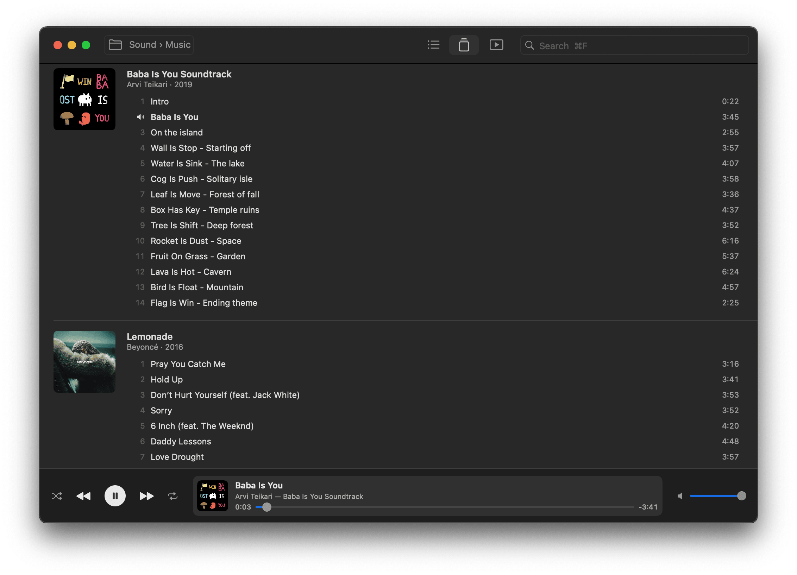

# Itsytunes

A small macOS music player for a local folder. It tags songs and finds album art automatically, and it can save audio from YouTube and sync your Bandcamp purchases.



Work in progress. Try it: download `Itsytunes.zip` from [Releases](https://github.com/AdamSzakal/Itsytunes/releases).

## Features

**Library**
- Plays every song in one folder and its subfolders. Works with Dropbox and iCloud folders; files that are only online are skipped unless you turn them on in Settings.
- Two views: a song list with columns you can sort, move and hide, or albums with their covers.
- Search with ⌘F. Click a cover to see it full size.

**Tags**
- Fills in missing title, artist, album, year, genre, track number and cover from the iTunes catalogue. MP3 files get the tags written into them.
- Cleans up titles: removes upload noise like video IDs, "(Official Video)" and track numbers. You check each change before it is saved.
- Fix Tags looks up selected songs or albums online again.

**YouTube** (⌘K)
- Search YouTube and save the audio of a video into your folder.
- A full album becomes one song per track: split by the video's chapters, by a tracklist in the description, or by the album's song lengths in the iTunes catalogue.
- New songs are selected in the list when they are ready.

**Bandcamp**
- Sign in with Bandcamp's own login page, then choose File › Sync Bandcamp to download your purchases. Later syncs get only new ones.
- Pick the format in Settings: MP3 320, MP3 V0, FLAC, AAC or Apple Lossless.
- Songs bought on Bandcamp show a small Bandcamp mark. Click it to open the artist's page.

**Playback**
- Shuffle, repeat, and the keyboard's play key. Shows in the macOS Now Playing controls.
- Keeps playing when the window is closed.

## Build

Requires macOS 14 and Xcode.

```sh
./scripts/build-app.sh
open "build/Itsytunes.app"
```

YouTube downloads need `brew install yt-dlp ffmpeg` and a YouTube Data API key (Settings). The YouTube API key and the Bandcamp sign-in are kept in your Keychain.
